# Test Plan for Content Factory

## Overview
This document outlines the comprehensive testing strategy for all modules in the Content Factory project that currently lack test coverage.

## Current Test Coverage Status

### ✅ Modules with Existing Tests
- [`config.py`](../src/config.py) - covered by [`test_config.py`](../tests/test_config.py)
- [`fetch_assets.py`](../src/fetch_assets.py) - covered by [`test_fetch_assets.py`](../tests/test_fetch_assets.py), [`test_fetch_retry.py`](../tests/test_fetch_retry.py), [`test_local_clips.py`](../tests/test_local_clips.py)
- [`select_track.py`](../src/select_track.py) - covered by [`test_generate_meta_and_select_track.py`](../tests/test_generate_meta_and_select_track.py), [`test_select_track_preferred.py`](../tests/test_select_track_preferred.py)
- [`state_store.py`](../src/state_store.py) - covered by [`test_state_store.py`](../tests/test_state_store.py)
- [`notify_n8n.py`](../src/notify_n8n.py) - covered by [`test_notify_n8n.py`](../tests/test_notify_n8n.py)
- [`main.py`](../src/main.py) - partially covered by [`test_main_cleanup.py`](../tests/test_main_cleanup.py), [`test_main_track_duration.py`](../tests/test_main_track_duration.py)
- [`render_video.py`](../src/render_video.py) - partially covered by [`test_render_motion_plan.py`](../tests/test_render_motion_plan.py), [`test_render_progress_parsing.py`](../tests/test_render_progress_parsing.py)

### ❌ Modules Requiring Test Coverage
1. [`generate_images.py`](../src/generate_images.py) - AI image generation via Pollinations API
2. [`render_images.py`](../src/render_images.py) - FFmpeg rendering from generated images
3. [`notify_telegram.py`](../src/notify_telegram.py) - Telegram bot notifications
4. [`upload_youtube.py`](../src/upload_youtube.py) - YouTube API upload
5. [`trigger_server.py`](../src/trigger_server.py) - FastAPI webhook server
6. [`tiktok_cuts.py`](../src/tiktok_cuts.py) - TikTok short video generation
7. [`logger.py`](../src/logger.py) - Logging setup
8. [`entrypoint.py`](../src/entrypoint.py) - Application entry point

## Test Architecture

```mermaid
graph TD
    A[Test Suite] --> B[Unit Tests]
    A --> C[Integration Tests]
    
    B --> D[generate_images.py]
    B --> E[render_images.py]
    B --> F[notify_telegram.py]
    B --> G[upload_youtube.py]
    B --> H[logger.py]
    B --> I[entrypoint.py]
    
    C --> J[trigger_server.py]
    C --> K[tiktok_cuts.py]
    C --> L[render_video.py]
    
    D --> D1[Prompt building]
    D --> D2[Image download]
    D --> D3[Error handling]
    
    E --> E1[FFmpeg concat]
    E --> E2[Zoom effects]
    E --> E3[Audio mixing]
    
    F --> F1[API calls]
    F --> F2[File uploads]
    F --> F3[Error handling]
    
    G --> G1[OAuth flow]
    G --> G2[Video upload]
    G --> G3[Metadata]
    
    H --> H1[Logger setup]
    H --> H2[Handler config]
    
    I --> I1[Mode routing]
    I --> I2[Config loading]
    
    J --> J1[Health endpoint]
    J --> J2[Run endpoint]
    J --> J3[TikTok endpoint]
    J --> J4[Auth middleware]
    
    K --> K1[Timeline building]
    K --> K2[Track selection]
    K --> K3[FFmpeg rendering]
    K --> K4[Duration probing]
    
    L --> L1[Full render flow]
    L --> L2[Error scenarios]
```



## Detailed Test Specifications

### 1. test_generate_images.py

**Module:** [`generate_images.py`](../src/generate_images.py)

**Test Cases:**
- `test_build_scene_prompts_creates_correct_count()` - Verify scene count calculation
- `test_build_scene_prompts_cycles_through_palette()` - Test palette rotation
- `test_build_scene_prompts_includes_tags()` - Verify tag inclusion in prompts
- `test_build_scene_prompts_includes_style_suffix()` - Test style suffix appending
- `test_generate_lora_style_images_creates_output_dir()` - Directory creation
- `test_generate_lora_style_images_downloads_all_scenes()` - Complete image generation
- `test_download_image_saves_file()` - Mock HTTP download
- `test_download_image_handles_network_error()` - Network failure handling
- `test_download_image_handles_http_error()` - HTTP error handling
- `test_generate_lora_style_images_uses_random_seeds()` - Seed randomization

**Mocking Strategy:**
- Mock `requests.get()` for image downloads
- Use `tmp_path` fixture for output directories
- Mock random seed for deterministic testing

### 2. test_render_images.py

**Module:** [`render_images.py`](../src/render_images.py)

**Test Cases:**
- `test_render_video_from_images_creates_concat_file()` - Concat list generation
- `test_render_video_from_images_includes_all_images()` - All images in concat
- `test_render_video_from_images_sets_scene_duration()` - Duration per scene
- `test_render_video_from_images_duplicates_last_frame()` - Last frame duplication
- `test_render_video_from_images_builds_correct_ffmpeg_command()` - Command construction
- `test_render_video_from_images_applies_zoompan_filter()` - Zoom effect
- `test_render_video_from_images_mixes_audio()` - Audio track mixing
- `test_render_video_from_images_raises_on_empty_images()` - Empty input handling
- `test_render_video_from_images_raises_on_ffmpeg_failure()` - FFmpeg error handling
- `test_run_ffmpeg_raises_on_nonzero_exit()` - Subprocess error handling

**Mocking Strategy:**
- Mock `subprocess.run()` for FFmpeg calls
- Use `tmp_path` for output directories
- Create minimal `GeneratedImage` fixtures

### 3. test_notify_telegram.py

**Module:** [`notify_telegram.py`](../src/notify_telegram.py)

**Test Cases:**
- `test_send_files_to_telegram_noop_when_empty_token()` - Empty token handling
- `test_send_files_to_telegram_noop_when_empty_chat_id()` - Empty chat ID handling
- `test_send_files_to_telegram_noop_when_empty_files()` - Empty file list handling
- `test_send_files_to_telegram_posts_each_file()` - Multiple file uploads
- `test_send_files_to_telegram_includes_caption()` - Caption formatting
- `test_send_files_to_telegram_uses_correct_api_url()` - API URL construction
- `test_send_files_to_telegram_sends_as_document()` - Document type
- `test_send_files_to_telegram_raises_on_http_error()` - HTTP error handling
- `test_send_files_to_telegram_handles_timeout()` - Timeout handling

**Mocking Strategy:**
- Mock `requests.post()` for Telegram API
- Use `tmp_path` to create test files
- Mock file reading operations

### 4. test_upload_youtube.py

**Module:** [`upload_youtube.py`](../src/upload_youtube.py)

**Test Cases:**
- `test_upload_video_creates_credentials()` - OAuth credentials creation
- `test_upload_video_builds_youtube_client()` - YouTube API client
- `test_upload_video_constructs_metadata()` - Video metadata structure
- `test_upload_video_sets_privacy_status()` - Privacy settings
- `test_upload_video_sets_publish_at_for_private()` - Scheduled publishing
- `test_upload_video_does_not_set_publish_at_for_public()` - Public video handling
- `test_upload_video_uses_correct_category()` - Category ID
- `test_upload_video_uses_correct_language()` - Language setting
- `test_upload_video_returns_video_id()` - Return value structure
- `test_upload_video_handles_upload_error()` - Upload failure handling

**Mocking Strategy:**
- Mock `google.oauth2.credentials.Credentials`
- Mock `googleapiclient.discovery.build()`
- Mock `MediaFileUpload` and upload execution
- Use `tmp_path` for test video files

### 5. test_trigger_server.py

**Module:** [`trigger_server.py`](../src/trigger_server.py)

**Test Cases:**
- `test_health_endpoint_returns_ok()` - Health check
- `test_run_endpoint_requires_auth()` - Authentication check
- `test_run_endpoint_accepts_valid_key()` - Valid API key
- `test_run_endpoint_rejects_concurrent_runs()` - Lock mechanism
- `test_run_endpoint_executes_pipeline()` - Pipeline execution
- `test_run_endpoint_handles_pipeline_error()` - Error handling
- `test_tiktok_cuts_endpoint_requires_auth()` - TikTok auth
- `test_tiktok_cuts_endpoint_resolves_paths()` - Path resolution
- `test_tiktok_cuts_endpoint_creates_clips()` - Clip generation
- `test_tiktok_cuts_endpoint_sends_telegram()` - Telegram integration
- `test_resolve_source_video_path_handles_absolute()` - Absolute path
- `test_resolve_source_video_path_searches_directories()` - Directory search
- `test_resolve_tracks_dir_uses_default()` - Default tracks directory

**Mocking Strategy:**
- Use FastAPI `TestClient` for endpoint testing
- Mock `pipeline_run()` function
- Mock `create_tiktok_cuts()` function
- Mock `send_files_to_telegram()` function
- Use `tmp_path` for file system operations

### 6. test_tiktok_cuts.py

**Module:** [`tiktok_cuts.py`](../src/tiktok_cuts.py)

**Test Cases:**
- `test_create_tiktok_cuts_raises_on_missing_source()` - Missing source file
- `test_create_tiktok_cuts_raises_on_no_tracks()` - No tracks available
- `test_create_tiktok_cuts_creates_output_dir()` - Directory creation
- `test_create_tiktok_cuts_probes_duration()` - Duration probing
- `test_create_tiktok_cuts_builds_timeline()` - Timeline generation
- `test_create_tiktok_cuts_shuffles_tracks()` - Track shuffling
- `test_create_tiktok_cuts_renders_all_clips()` - All clips rendered
- `test_create_tiktok_cuts_calls_callback()` - Callback invocation
- `test_build_timeline_fixed_count_mode()` - Fixed count mode
- `test_build_timeline_auto_mode()` - Auto split mode
- `test_build_timeline_respects_min_max_seconds()` - Duration bounds
- `test_probe_media_duration_seconds_parses_value()` - Duration parsing
- `test_probe_media_duration_seconds_returns_none_on_error()` - Error handling
- `test_render_one_clip_builds_correct_command()` - FFmpeg command
- `test_render_one_clip_raises_on_failure()` - Render failure

**Mocking Strategy:**
- Mock `subprocess.run()` for FFmpeg and ffprobe
- Use `tmp_path` for source videos and output
- Mock track file discovery
- Use deterministic random seeds

### 7. test_logger.py

**Module:** [`logger.py`](../src/logger.py)

**Test Cases:**
- `test_setup_logger_creates_logger()` - Logger creation
- `test_setup_logger_sets_correct_name()` - Logger name
- `test_setup_logger_sets_info_level()` - Log level
- `test_setup_logger_adds_stream_handler()` - Handler addition
- `test_setup_logger_uses_stdout()` - Output stream
- `test_setup_logger_formats_correctly()` - Formatter configuration
- `test_setup_logger_returns_same_instance()` - Singleton behavior
- `test_setup_logger_does_not_duplicate_handlers()` - No duplicate handlers

**Mocking Strategy:**
- Capture log output with `caplog` fixture
- Test handler configuration
- Verify singleton pattern

### 8. test_entrypoint.py

**Module:** [`entrypoint.py`](../src/entrypoint.py)

**Test Cases:**
- `test_main_oneshot_mode_runs_pipeline()` - Oneshot mode execution
- `test_main_webhook_mode_starts_server()` - Webhook mode execution
- `test_main_loads_config()` - Config loading
- `test_main_sets_up_logger()` - Logger initialization
- `test_main_handles_config_error()` - Config error handling
- `test_main_handles_pipeline_error()` - Pipeline error handling

**Mocking Strategy:**
- Mock `load_config()` function
- Mock `setup_logger()` function
- Mock `run_pipeline()` function
- Mock `start_trigger_server()` function
- Use monkeypatch for environment variables

### 9. test_render_video_integration.py (Additional)

**Module:** [`render_video.py`](../src/render_video.py) - Integration tests

**Test Cases:**
- `test_render_video_with_ffmpeg_creates_output()` - Full render flow
- `test_render_video_with_ffmpeg_creates_concat_list()` - Concat file
- `test_render_video_with_ffmpeg_creates_stitched_video()` - Stitched video
- `test_render_video_with_ffmpeg_loops_in_normal_mode()` - Looping behavior
- `test_render_video_with_ffmpeg_no_loop_in_strict_mode()` - No-repeat mode
- `test_render_video_with_ffmpeg_pads_short_video()` - Tail padding
- `test_render_video_with_ffmpeg_raises_on_no_clips()` - Empty clips
- `test_render_video_with_ffmpeg_raises_on_ffmpeg_failure()` - FFmpeg error

**Mocking Strategy:**
- Mock all FFmpeg subprocess calls
- Use `tmp_path` for all file operations
- Create minimal `ClipAsset` fixtures

## Testing Tools and Dependencies

### Required Packages
- `pytest==8.3.5` (already installed)
- `pytest-mock` (for mocker fixture)
- `pytest-cov` (for coverage reporting)

### Testing Patterns
1. **Mocking External Dependencies**: All external API calls, subprocess executions, and file I/O should be mocked
2. **Temporary File Handling**: Use `tmp_path` fixture for all file operations
3. **Deterministic Testing**: Use fixed random seeds where randomness is involved
4. **Error Scenarios**: Test both success and failure paths
5. **Edge Cases**: Test empty inputs, boundary conditions, and invalid data

## Coverage Goals

- **Target Coverage**: 80%+ for all new test files
- **Critical Paths**: 100% coverage for error handling and authentication
- **Integration Points**: Full coverage of API interactions and subprocess calls

## Test Execution

```bash
# Run all tests
pytest

# Run specific test file
pytest tests/test_generate_images.py

# Run with coverage
pytest --cov=src --cov-report=html

# Run with verbose output
pytest -v

# Run only new tests
pytest tests/test_generate_images.py tests/test_render_images.py tests/test_notify_telegram.py tests/test_upload_youtube.py tests/test_trigger_server.py tests/test_tiktok_cuts.py tests/test_logger.py tests/test_entrypoint.py
```

## Implementation Order

1. **Simple Modules First** (low complexity, few dependencies)
   - `test_logger.py`
   - `test_entrypoint.py`

2. **API Integration Modules** (external dependencies)
   - `test_generate_images.py`
   - `test_notify_telegram.py`
   - `test_upload_youtube.py`

3. **FFmpeg Modules** (subprocess complexity)
   - `test_render_images.py`
   - `test_tiktok_cuts.py`

4. **Complex Integration** (multiple dependencies)
   - `test_trigger_server.py`
   - `test_render_video_integration.py`

## Success Criteria

- ✅ All 9 test files created
- ✅ All tests pass successfully
- ✅ 80%+ code coverage achieved
- ✅ No flaky tests (deterministic results)
- ✅ Clear test names and documentation
- ✅ Proper mocking of external dependencies
- ✅ Fast test execution (< 5 seconds total)

## Maintenance Guidelines

1. **Keep Tests Updated**: When source code changes, update corresponding tests
2. **Add Tests for Bugs**: When fixing bugs, add regression tests
3. **Review Coverage**: Regularly check coverage reports and fill gaps
4. **Refactor Tests**: Keep tests DRY and maintainable
5. **Document Complex Tests**: Add comments for non-obvious test logic
